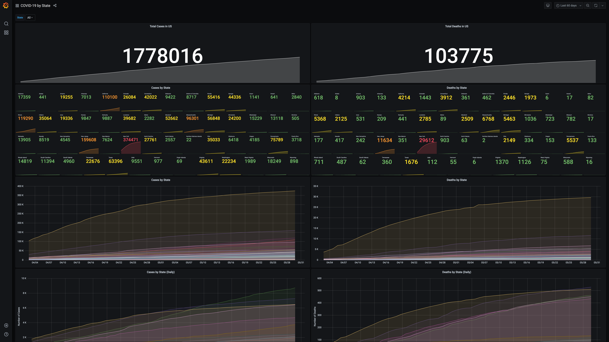

covid-19-grafana
===

There are [many](https://blog.mapbox.com/notable-maps-visualizing-covid-19-and-surrounding-impacts-951724cc4bd8) [great](https://www.nytimes.com/interactive/2020/us/coronavirus-us-cases.html) [visualizations](https://public.tableau.com/en-us/s/covid-19-viz-gallery) around COVID-19. I wanted to contribute a tool that enables people to visualize the impact of COVID-19 at a state-by-state level.

Data is pulled from [New York Times Coronavirus (Covid-19) Data in the United States](https://github.com/nytimes/covid-19-data). This data is imported into InfluxDB and visualized in Grafana, both running in Docker on EC2.

# Contributing
Contributions are welcome. Here are some features/improvements:
- **Grafana annotations** - state reopening, government leader's responses
- **Data normalization** - there are lots of factors at play (testing, reporting, suspected vs. confirmed cases and deaths)
- **Map** - NY Times data includes FIPS, which can be used to relate this data to a map, such as the [worldmap panel](https://grafana.com/grafana/plugins/grafana-worldmap-panel/installation) for Grafana
- **Auto-update data** - NY Times updates every day. Could either add cron to Cloudinit script to pull a few times a day, or use something like Zapier to tell EC2 instance to pull new data

# Running it locally
- `docker-compose up` - Start InfluxDB and Grafana
- Clone [fabio-miranda/csv-to-influxdb](https://github.com/fabio-miranda/csv-to-influxdb/blob/master/csv-to-influxdb.py)
- `wget https://raw.githubusercontent.com/nytimes/covid-19-data/master/us-counties.csv` - Download latest NY Times
- `python csv-to-influxdb.py -i us-counties.csv --dbname covid-19 --create --timecolumn date --timeformat '%Y-%m-%d' --tagcolumns county,state,fips --fieldcolumns cases,deaths` - Import CSV into InfluxDB
- Visit `localhost:3000` in your browser
